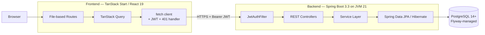
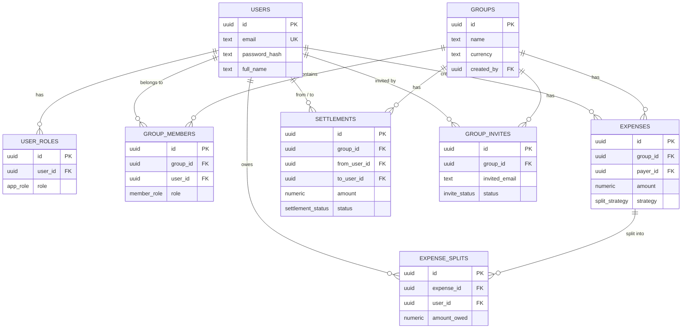
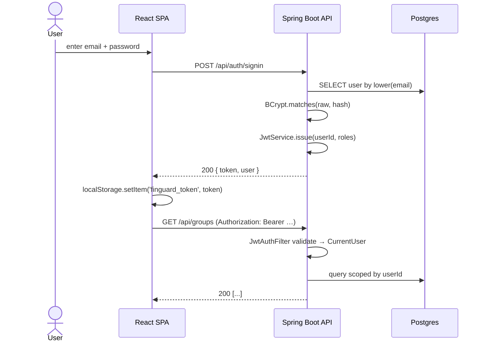
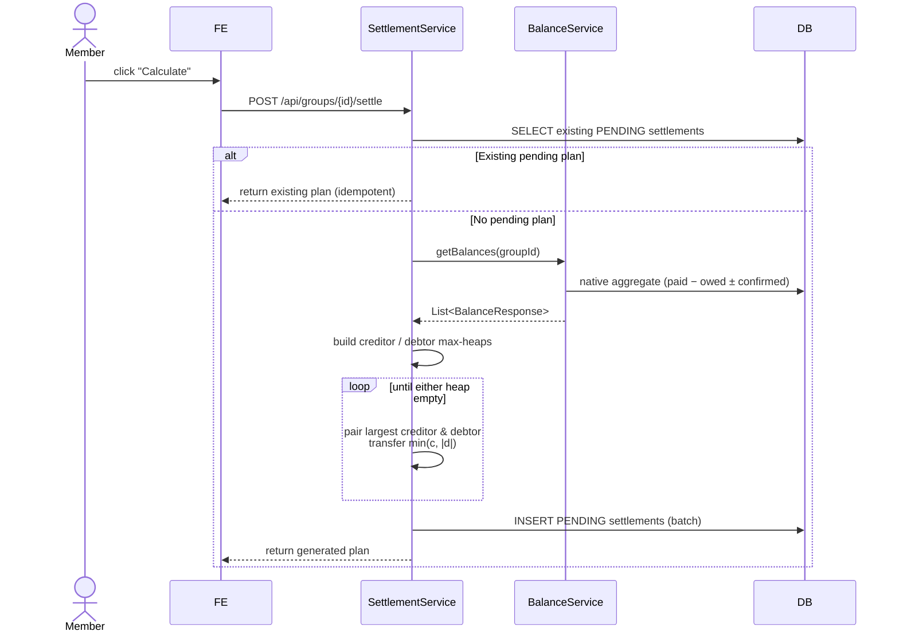
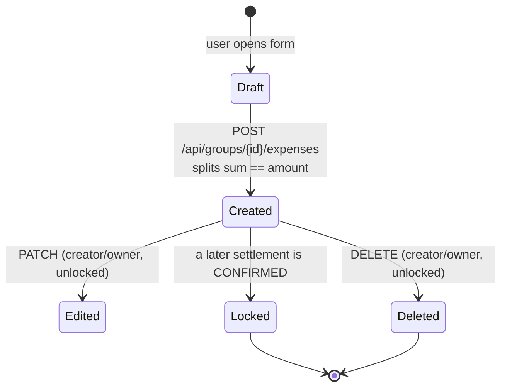
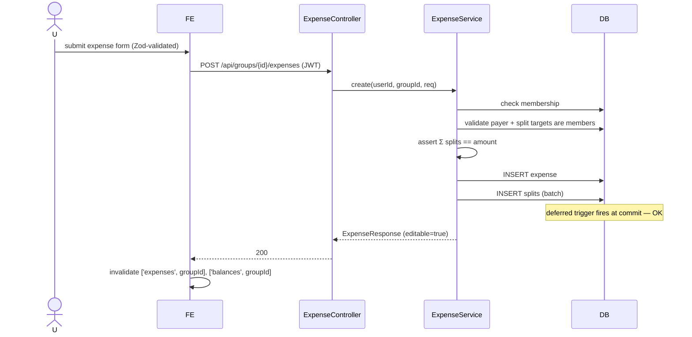
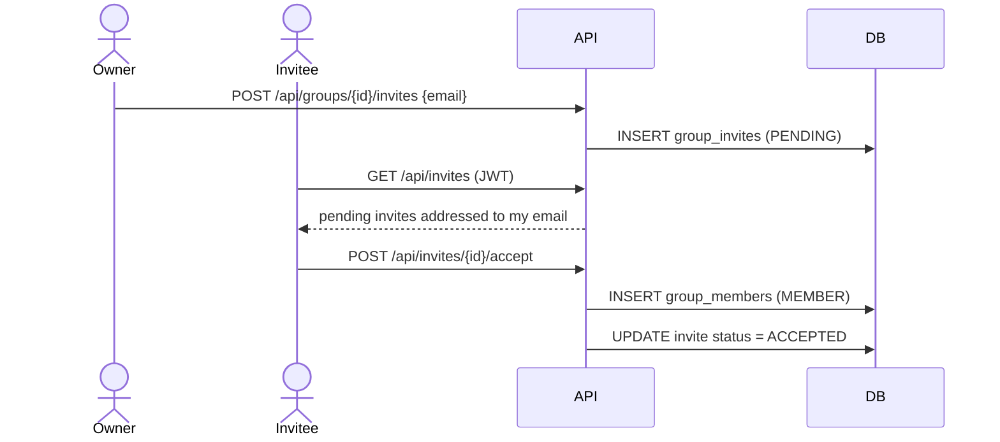
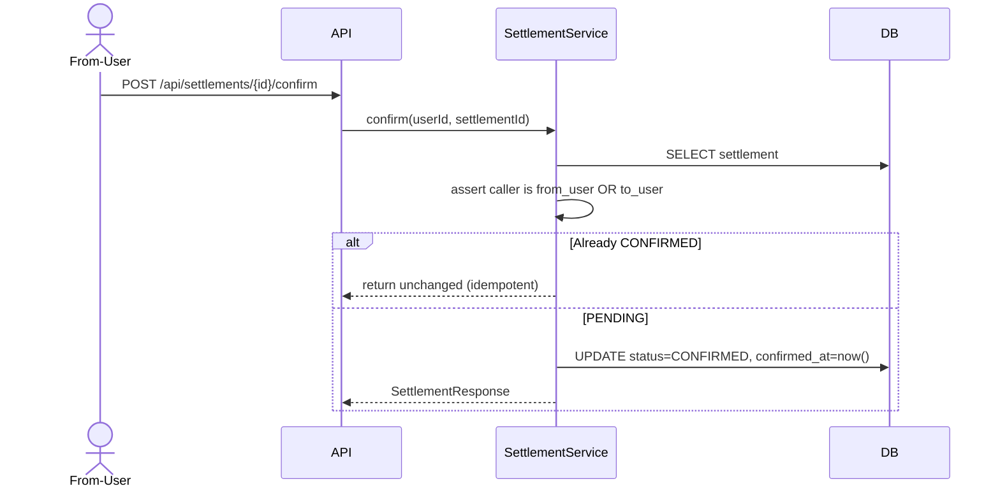

# FinGuard — Architecture

This document describes how FinGuard is put together end-to-end: the runtime topology, the internal structure of each side, the data model, and the reasoning behind the significant technical decisions. It is written to be usable as interview preparation and as a design reference.

---

## 1. High-Level Architecture



Two independently deployable processes communicating over HTTP. No shared state, no server-side session storage.

---

## 2. Detailed Architecture

- **Frontend (SPA)**: React 19 + TanStack Start with file-based routing. Data fetching goes through TanStack Query keyed by the resource and JWT identity; mutations invalidate the relevant caches. A single `fetch` wrapper (`src/lib/api/client.ts`) attaches the JWT from `localStorage` on every request, normalizes errors, and dispatches a sign-out event on `401`.
- **Backend (REST API)**: Spring Boot 3.3 with Spring Security 6. Stateless — every request carries a bearer JWT which is validated by `JwtAuthFilter` and materialized into a `CurrentUser` principal for the request.
- **Database**: PostgreSQL with Flyway migrations. Money is `numeric(10,2)`. A **deferred constraint trigger** enforces the invariant that expense splits always sum to the parent expense amount at commit time.
- **Boundary**: The client never talks to the database. All authorization happens server-side inside `@Service` methods, before any write.

---

## 3. Frontend Architecture

```
src/
├── routes/
│   ├── __root.tsx                  # Root layout, head metadata
│   ├── index.tsx                   # Landing / redirect
│   ├── auth.tsx                    # Signin + signup form
│   └── _authenticated/             # Layout route with auth gate
│       ├── route.tsx               # Redirects to /auth if no token
│       ├── groups.tsx              # List groups
│       ├── groups_.$groupId.tsx    # Group detail (expenses, balances, settlements)
│       └── profile.tsx
├── lib/api/                        # Typed REST client
│   ├── client.ts                   # fetch wrapper, JWT, 401 handling
│   ├── auth.ts · groups.ts · expenses.ts
│   ├── invites.ts · settlements.ts · profile.ts
├── hooks/use-auth.ts               # Session state + local storage
└── components/                     # UI + feature components (shadcn/ui + custom)
```

Design principles:

- **File-based routing** collocates route metadata, loader, and component per URL.
- **TanStack Query** owns the client cache; components render from the cache and re-fetch on invalidation.
- **Every mutation goes through the API client**, so the JWT and error contract exist in exactly one place.
- **The route `_authenticated`** is a layout gate: no token in `localStorage` → redirect to `/auth` before any child renders.

---

## 4. Backend Architecture

Package-by-feature. Each feature owns its own controllers, DTOs, entities, repositories, services, and (where applicable) mappers. Cross-cutting concerns live in `common/`, `config/`, and `security/`.

Rules:

- **Thin controllers** — parse, delegate, return.
- **Service layer owns the transaction boundary** (`@Transactional` on methods, `readOnly = true` for reads).
- **Records for DTOs**. Entities are never serialized to the wire.
- **Constructor injection** everywhere; no field injection.
- **MapStruct** for entity ↔ DTO where the mapping is more than trivial.
- **SLF4J** logging; secrets and passwords never enter log statements.
- **Global exception handler** returns a uniform envelope for every failure.

---

## 5. Package Structure

```
com.ps.finguard
├── FinGuardApplication.java
│
├── auth/           controller/  dto/  service/
├── profile/        controller/  dto/  mapper/ service/
├── group/          controller/  dto/  entity/ mapper/ repository/ service/
├── invite/         controller/  dto/  entity/ repository/ service/
├── expense/        controller/  dto/  entity/ repository/ service/
├── balance/        dto/  service/
├── settlement/     controller/  dto/  entity/ repository/ service/
├── user/           entity/  repository/
│
├── security/       JwtService · JwtAuthFilter · CurrentUser · AuthUtil
├── config/         SecurityConfig · OpenApiConfig · JpaAuditingConfig
└── common/         BaseEntity · Money · AppException · ApiError · GlobalExceptionHandler · PgEnumType
```

---

## 6. Database Architecture

- **Postgres-native types**: `uuid` PKs, `numeric(10,2)` money, `timestamptz` timestamps, native `ENUM`s.
- **Referential integrity**: `ON DELETE CASCADE` for owned children (group → members / expenses / settlements), `ON DELETE RESTRICT` for shared references (a user with expenses cannot be hard-deleted).
- **Uniqueness constraints**: `(group_id, user_id)` on `group_members`, `(expense_id, user_id)` on `expense_splits`, `(user_id, role)` on `user_roles`.
- **Check constraints**: `amount > 0` on expenses & settlements, `amount_owed >= 0` on splits, `from_user_id <> to_user_id` on settlements.
- **Indexes**: `lower(email)` on users, `(group_id, created_at DESC)` on expenses, `(group_id, status)` on settlements, `(user_id)` on group_members / splits.
- **Deferred constraint trigger** `trg_expense_splits_sum` — fires at commit, verifies `SUM(amount_owed) == expense.amount`.

### ER Diagram



---

## 7. Authentication Flow



- **Signup** hashes the password with BCrypt(12), inserts the user, grants the `USER` role, and returns the same token envelope.
- **Filter chain**: `JwtAuthFilter` runs before Spring's authentication filter, parses the `Authorization` header, verifies the HS256 signature, and sets the `SecurityContext`. Missing/invalid tokens on protected endpoints yield `401`.

---

## 8. Request Lifecycle

```
HTTP request
  → Servlet container
  → CORS filter
  → JwtAuthFilter (parses & validates JWT, sets SecurityContext)
  → Spring Security authorization
  → DispatcherServlet
  → @RestController method (thin: validate DTO, delegate)
  → @Service method (opens @Transactional boundary, re-checks authorization,
                     performs work via repositories)
  → Spring Data JPA / Hibernate
  → PostgreSQL
  ← Response DTO (record) → JSON via Jackson
```

On any exception, `GlobalExceptionHandler` maps it to
`{timestamp, status, error, message, path}` with the appropriate HTTP status.

---

## 9. Settlement Algorithm Lifecycle



Key properties: **idempotent** (rerun returns same plan while it is unacted), **bounded** (at most `n − 1` transactions for `n` non-zero balances), **cycle-safe** (fully cancelling ledger → empty plan).

---

## 10. Expense Lifecycle



Editability rule (`ExpenseService.requireEditable`):
`expense.created_at > MAX(settlements.confirmed_at) for group` → editable, else 403.

The write path (`create` / `update`) runs inside a single `@Transactional` boundary. Splits are rewritten by delete + insert; the deferred trigger validates the sum at commit, so an unbalanced rewrite rolls back atomically.

---

## 11. Group Lifecycle

```mermaid
stateDiagram-v2
  [*] --> Created: POST /api/groups (creator → OWNER)
  Created --> Invited: POST /api/groups/{id}/invites
  Invited --> Joined: POST /api/invites/{id}/accept
  Invited --> Declined: POST /api/invites/{id}/decline
  Joined --> Active
  Created --> Renamed: PATCH (owner)
  Active --> Deleted: DELETE (owner, cascades)
  Deleted --> [*]
```



---

## 12. Sequence Diagrams

### 12.1 User Login
See §7.

### 12.2 Create Expense



### 12.3 Settlement Generation
See §9.

### 12.4 Invite Flow



### 12.5 Expense Confirmation (Settlement)



---

## 13. Database ER Diagram
See §6.

---

## 14. Major Modules Explained

- **`auth`** — signup / signin / me. Owns password hashing and JWT issuance.
- **`profile`** — read/update the authenticated user's display name and avatar.
- **`group`** — group CRUD, membership look-ups, ownership checks (`requireOwner`, `requireMembership`).
- **`invite`** — email-based invites: create (owner), list mine, accept, decline. Accept converts an invite into a `group_members` row.
- **`expense`** — expense CRUD, membership + split validation, editability check against the latest confirmed settlement.
- **`balance`** — a single native SQL that aggregates `paid − owed ± confirmed` per member and returns every member (including zero balances).
- **`settlement`** — the debt-minimization engine, plan persistence, confirmation.
- **`user`** — `UserEntity` + `UserRoleEntity` and their repositories.
- **`security`** — `JwtService` (issue/verify), `JwtAuthFilter` (per-request), `CurrentUser` (typed principal), `AuthUtil.requireId()` (never trust client-supplied IDs).
- **`common`** — `Money` (scale/epsilon), `BaseEntity` (auditing), `AppException` (typed 4xx/5xx), `GlobalExceptionHandler`, `PgEnumType`.
- **`config`** — Spring Security config, OpenAPI config, JPA auditing config.

---

## 15. Frontend ↔ Backend Communication

- **Transport**: JSON over HTTPS.
- **Auth**: `Authorization: Bearer <jwt>` header on every non-auth request. Token stored in `localStorage` under `finguard_token`.
- **Client**: `src/lib/api/client.ts` wraps `fetch`. It attaches the token, sets `Content-Type: application/json`, parses the response, throws typed errors, and dispatches a global `sign-out` event on `401`.
- **Errors**: the backend returns `{timestamp, status, error, message, path}` uniformly, so the client can render a single error toast component.
- **Caching**: TanStack Query keys are `[resource, ...ids]` (e.g. `['expenses', groupId]`). Mutations invalidate the relevant keys instead of mutating the cache manually.

---

## 16. Transaction Boundaries

- The transaction boundary is the **service method**, not the controller and not the repository. Controllers never open transactions.
- `@Transactional(readOnly = true)` on read paths (`list`, `getBalances`, `history`) — enables JDBC read-only optimizations and avoids accidental writes.
- `@Transactional` on write paths (`create`, `update`, `delete`, `settle`, `confirm`) — one method, one atomic unit.
- The **`expense.update`** case is the interesting one: it deletes existing splits, flushes, and inserts new splits inside one transaction. The Postgres deferred trigger fires only at commit, so intermediate imbalance is allowed but a final imbalance rolls the whole update back.
- Batch inserts in `settlement.settle` use a single `saveAll`; the whole plan either lands or none of it does.

---

## 17. Authorization

- **Authentication** (who are you?) is handled by `JwtAuthFilter`.
- **Authorization** (are you allowed?) is handled inside each service method, always using `AuthUtil.requireId()` — the caller ID from the JWT — and never a value from the request body.
- Common checks: `requireMembership(groupId, userId)`, `requireOwner(groupId, userId)`, `requireCanModify(userId, expense)` (creator OR owner), `requireEditable(expense)` (not locked by a later confirmed settlement).
- Settlement confirmation is scoped to the two parties: only `from_user_id` or `to_user_id` may confirm.
- Errors are `AppException.forbidden(...)` → HTTP 403 with the uniform envelope.

---

## 18. Why Spring Boot

- Mature, enterprise-standard framework — hiring signal for Java backend roles.
- First-class integrations for the exact ingredients this project needs: security, JPA, validation, migrations, OpenAPI.
- Constructor-injection + `@Transactional` model produces a clean, testable service layer.
- Convention-over-configuration keeps the codebase focused on domain logic instead of plumbing.

## 19. Why PostgreSQL

- Native `numeric` type for money — no floating-point drift.
- Native `ENUM`s map cleanly to Java enums.
- **Deferred constraint triggers** — the split-sum invariant lives in the database, not just in service code, so a bug in any writer cannot corrupt the ledger.
- Rich indexing (`lower(email)`), strong referential integrity (`ON DELETE CASCADE / RESTRICT`), transactional DDL.
- Ubiquitous, well-documented, easy to run locally.

## 20. Why BigDecimal

- `double` cannot represent `0.1 + 0.2` exactly; summing splits or netting balances in floating point produces off-by-one-cent drift that compounds and leaves a "settled" group with a phantom ₹0.01 balance.
- `BigDecimal` with scale = 2 and `RoundingMode.HALF_UP` at every arithmetic boundary produces exact, auditable arithmetic and maps 1:1 to Postgres `numeric(10,2)`.
- Centralized in `common/Money.java` so scaling and epsilon handling exist in exactly one place.

## 21. Why JWT

- **Stateless**: no server-side session table, no sticky-session load balancer requirements. Any backend instance can validate any token.
- **Standard**: `Authorization: Bearer` is understood by every HTTP client and reverse proxy.
- **Self-contained**: the token carries `sub` (user id) and roles, so `JwtAuthFilter` can build a `CurrentUser` without a DB round-trip on every request.
- Trade-off (called out in Limitations): revocation is not instantaneous — a compromised token is valid until it expires. That is acceptable for this project's scope.

---

## 22. Performance Considerations

- **Indexes**: `lower(email)` on users; `(group_id, created_at DESC)` on expenses; `(group_id, status)` on settlements; `(user_id)` on group_members / splits. All hot query paths are index-backed.
- **Balances** compute in a single native SQL using CTEs, not N+1 queries.
- **Settlements** batch-insert via `saveAll`.
- **Read-only transactions** on list endpoints enable JDBC read-only optimizations.
- **Hibernate** first-level cache scoped to the transaction avoids repeated look-ups within a request.
- **Frontend**: TanStack Query caches, dedupes in-flight requests, and re-uses cached data across route mounts.

## 23. Scalability Considerations

- Stateless backend → horizontal scaling is trivial; put N instances behind a load balancer.
- Postgres is the vertical bottleneck for writes. Read replicas would offload balance / history reads; write throughput would move to partitioning by `group_id` before sharding.
- JWTs remove the shared-session-store requirement.
- Nothing in the design assumes a single-process runtime.

## 24. Architectural Limitations

- **JWT revocation** is coarse (wait for expiry) — no server-side blacklist.
- **No refresh tokens** — the client re-authenticates on token expiry.
- **Debt minimization is greedy**, not provably globally optimal — acceptable for the target use case (Splitwise-scale groups) but noted honestly.
- **Balances are computed on demand** rather than materialized. Fine for small groups; large or high-write groups would benefit from a materialized view or an event-sourced projection.
- **Single-currency per group** — no FX conversion.
- **No soft-delete / audit log** beyond the settlements-are-immutable invariant.
- **No caching layer** (Redis / HTTP caching) — every request hits Postgres.
- **No rate-limiting or brute-force protection** on `/api/auth/signin` at the application layer — assumed to be provided by an upstream WAF / API gateway in production.
