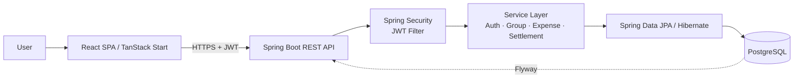

# FinGuard

**A group expense-splitting application with an automated debt-minimization settlement engine.**

FinGuard turns a messy web of "who owes whom" inside a shared group into the smallest possible set of payments that settle everyone. Where a naive per-expense ledger produces N transactions for N expenses, FinGuard collapses them into at most `members − 1` transfers — and correctly recognizes when circular debts cancel out to zero.

---

## 1. Project Overview

Anyone who has shared rent, split a trip, or run a tab with friends knows the pattern: Alice pays for dinner, Bob covers the cab, Carol tops up the groceries, and after a week nobody can remember the actual net position. Manual tracking produces phantom balances — Alice owes Bob who owes Carol who owes Alice — that could be cancelled by inspection but rarely are.

FinGuard solves that problem for a defined group of people (roommates, trip organizers, small teams) by:

- Recording expenses with an explicit payer and per-member split,
- Deriving each member's net position from the ledger, and
- Producing a **minimal settlement plan** — the fewest transfers required to zero out every balance — using a greedy debt-minimization algorithm.

The application is aimed at end users who want a Splitwise-style workflow with a transparent, auditable settlement mechanism, and at engineers who want a reference implementation of the algorithm end-to-end.

---

## 2. Key Features

- ✅ Email/password authentication with self-issued **JWT** sessions
- ✅ Group creation with owner / member roles
- ✅ Email-based **invite** flow with accept / decline
- ✅ Expenses with **EQUAL** or **CUSTOM_PERCENTAGE** split strategies
- ✅ Automatic **balance calculation** per member (paid − owed ± confirmed settlements)
- ✅ **Debt-minimization settlement engine** with idempotent plan generation
- ✅ **Settlement confirmation** by payer or receiver
- ✅ **Settlement history** per group
- ✅ **Expense lock** after a settlement is confirmed (prevents retroactive edits)
- ✅ Deferred database constraint ensuring splits always sum to the expense amount
- ✅ Uniform error envelope with structured validation errors
- ✅ OpenAPI / Swagger UI for the entire REST surface

---

## 3. Screenshots

Placeholders — replace with real captures:

- `/docs/images/dashboard.png` — groups dashboard
- `/docs/images/group-detail.png` — group with expenses & balances
- `/docs/images/settlement.png` — generated settlement plan
- `/docs/images/history.png` — settlement history

---

## 4. Tech Stack

**Frontend**
- React 19 + TypeScript (strict mode)
- TanStack Start v1 (file-based routing) + TanStack Query v5
- Tailwind CSS v4 + shadcn/ui (Radix primitives)
- Zod for validation at every mutation boundary
- Central `fetch` client (JWT attach, 401 → sign-out)

**Backend**
- Java 21, Spring Boot 3.3 (Web, Data JPA, Security, Validation)
- Spring Security 6 (stateless JWT)
- Hibernate + Spring Data JPA
- MapStruct for entity ↔ DTO mapping
- Lombok, Jakarta Validation, SLF4J
- springdoc-openapi (Swagger UI)
- Maven (bundled wrapper)

**Database**
- PostgreSQL 14+
- Flyway migrations (`V1__init.sql`)
- Deferred constraint trigger for split integrity
- Money stored as `numeric(10,2)`

**Security**
- BCrypt (strength 12) password hashing
- Stateless JWT (HS256, jjwt 0.12.x)
- Role-based (`USER`, `ADMIN`) with a separate `user_roles` table
- Server-side re-verification for every mutation
- Bean Validation on every request DTO

**Tools**
- Bun (frontend), Maven (backend)
- Docker-friendly Postgres
- Prettier, ESLint

---

## 5. High-Level Architecture



---

## 6. Folder Structure

```
finguard/
├── src/                          # React frontend
│   ├── routes/                   # File-based routes (TanStack Start)
│   ├── components/               # UI + feature components
│   ├── lib/api/                  # Typed REST client (auth, groups, expenses, ...)
│   └── hooks/                    # use-auth, use-mobile, ...
│
├── backend/                      # Spring Boot backend
│   ├── pom.xml
│   └── src/main/
│       ├── java/com/ps/finguard/
│       │   ├── auth/             # controller · dto · service
│       │   ├── group/
│       │   ├── invite/
│       │   ├── expense/
│       │   ├── balance/
│       │   ├── settlement/
│       │   ├── profile/
│       │   ├── user/
│       │   ├── security/         # JwtService · JwtAuthFilter · CurrentUser
│       │   ├── config/           # SecurityConfig · OpenApiConfig · JpaAuditingConfig
│       │   └── common/           # BaseEntity · Money · AppException · GlobalExceptionHandler
│       └── resources/
│           ├── application.yml
│           └── db/migration/V1__init.sql
│
└── README.md
```

---

## 7. API Overview

All endpoints are namespaced under `/api`. All non-auth endpoints require `Authorization: Bearer <token>`.

| Group | Purpose |
| --- | --- |
| **Authentication** | Signup, signin, current user |
| **Profile** | View / update the authenticated user |
| **Groups** | Create, list, rename, delete groups |
| **Invites** | Invite by email, accept, decline |
| **Expenses** | Create, edit, delete with split strategy |
| **Balances** | Per-member net balance for a group |
| **Settlements** | Generate plan, confirm, history |

Full endpoint reference: [`backend/README.md`](./backend/README.md). Interactive docs: `http://localhost:8081/swagger-ui.html`.

---

## 8. Settlement Algorithm Overview

Every member has a signed net balance (positive = the group owes them; negative = they owe the group). Because money is conserved, these balances sum to zero. A *minimal settlement* is a set of transfers from debtors to creditors that zeroes every balance with the fewest transactions.

FinGuard uses a **greedy largest-creditor / largest-debtor pairing** implemented with two max-heaps. At each step it takes the biggest creditor and biggest debtor, transfers `min(creditor, |debtor|)`, and pushes any non-zero remainder back onto its heap. This guarantees at most `n − 1` transactions for `n` non-zero balances and correctly returns an **empty plan** for a fully cancelling ledger (circular debts).

The general minimum-transaction settlement problem is NP-hard, so this greedy heuristic — the same approach used by production apps like Splitwise — is a deliberate engineering choice: near-optimal in practice, deterministic, and cheap to compute.

Deep dive: `ARCHITECTURE.md` and `PROJECT_EXPLANATION.md`.

---

## 9. Security Highlights

- **JWT (HS256)** — stateless bearer tokens issued by the backend; no server-side session storage.
- **BCrypt (strength 12)** — password hashes are never logged and never leave the service layer.
- **Server-side authorization** — every mutating service method re-checks membership / ownership / editability using the JWT-derived user ID, not any client-supplied identifier.
- **Bean Validation** — every request DTO is annotated with Jakarta Validation; a global exception handler emits a uniform error envelope.
- **Role-based access** — roles are stored in a dedicated `user_roles` table (never on the `users` row) to prevent privilege-escalation-by-column-update.
- **Expense lock** — an expense becomes immutable once a later settlement is confirmed, preventing retroactive-ledger attacks.

---

## 10. Running Locally

### Prerequisites

- JDK 21, Maven (or the bundled `./mvnw`)
- Bun (or Node 20+)
- PostgreSQL 14+

### Backend

```bash
cd backend
createdb finguard
export DB_URL=jdbc:postgresql://localhost:5432/finguard
export DB_USER=finguard
export DB_PASSWORD=finguard
export JWT_SECRET="$(openssl rand -base64 64)"
export APP_CORS_ORIGINS=http://localhost:8080
./mvnw spring-boot:run       # http://localhost:8081
```

Flyway applies `V1__init.sql` on first boot.

### Frontend

```bash
bun install
# .env already contains VITE_API_BASE_URL=http://localhost:8081/api
bun run dev                   # http://localhost:8080
```

### Environment variables

| Name | Where | Purpose |
| --- | --- | --- |
| `DB_URL` / `DB_USER` / `DB_PASSWORD` | backend | Postgres connection |
| `JWT_SECRET` | backend | HS256 signing key (min 512 bits recommended) |
| `JWT_EXPIRY_MINUTES` | backend | Token TTL (default 1440) |
| `APP_CORS_ORIGINS` | backend | Comma-separated allowed origins |
| `SERVER_PORT` | backend | HTTP port (default 8081) |
| `VITE_API_BASE_URL` | frontend | Backend base URL (`http://localhost:8081/api`) |

---

## 11. Future Improvements

- Refresh tokens + token rotation
- Multi-currency groups with FX conversion
- Recurring expenses and templates
- Receipt image uploads
- Partial settlement confirmation
- Settlement reversal as a first-class operation
- CSV / PDF export of ledger and history
- Push / email notifications on invite, expense, and settlement events
- Group-level analytics and spend trends
- OAuth social login

---

## 12. License

MIT — see `LICENSE`.
